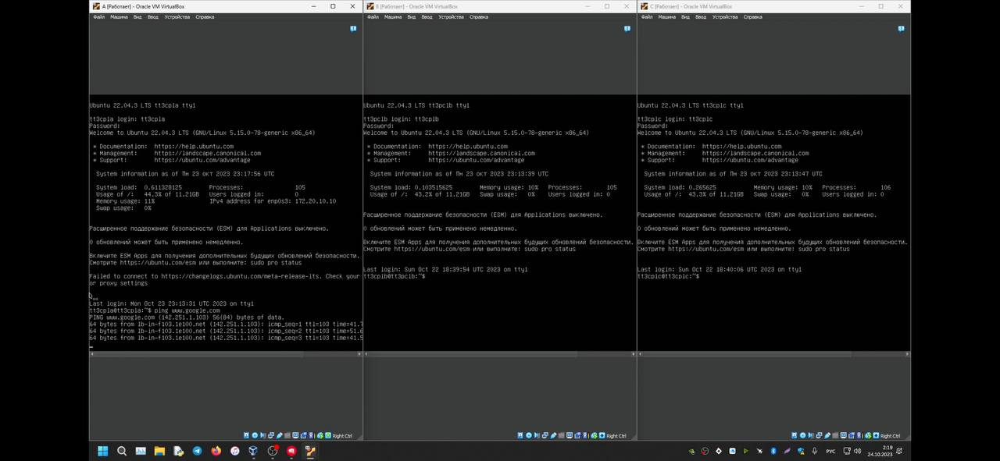
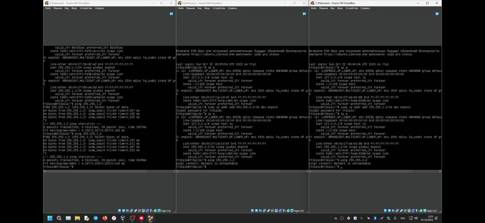

Открываем витуал бокс:
1) создаем 3 машины (A,В,С)
2) в настройках А в разделе сети ставим 3 адаптера(1 - сетевой мост, 2 - внутренняя сеть, 3 - внутренняя сеть)
3) в настройках B в разделе сети ставим 1 адаптера(1 - внутренняя сеть)
4) в настройках C в разделе сети ставим 1 адаптера(1 - внутренняя сеть)
5) так же я использовал серверную убунту, так что в каждой ВМ ставим в разделе носители наш ubuntuserver.iso
6) дальше запускаем наши 3 ВМ и чкачиваем на них ubuntu
7) логинемся в каждой ВМ под разными логинами(но если под одной ничего страшного)
8) заходим в каждой ВМ под нашим логинам и выполняем слудующие действия:

порядок выполнения самой лабораторной:
1) зайти в А и написать ping www.google.com (делаем скриншот)
3) пишем ip a (делаем скриншот где все пусто)
4) пишем sudo ip addr add 255.255.0.1/24 dev enp0s8 
5) пишем ip a (делаем скрин того что у нас добавился ip в enp0s8)
6) заходим в B пишем пишем ip a (делаем скриншот где все пусто)
7) пишем sudo ip addr add 255.255.0.2/24 dev enp0s3
8) пишем ip a (делаем скрин того что у нас добавился ip в enp0s3)
9) заходим в А пишем ping 255.255.0.2 (делаем скрин что пакеты пошли)
10) далее в А пишем sudo ip addr add 255.255.1.1/24 dev enp0s9
11) пишем ip a (делаем скрин того что у нас добавился ip в enp0s9)
12) заходим в C пишем пишем ip a (делаем скриншот где все пусто)
13) пишем в С sudo ip addr add 255.255.1.2/24 dev enp0s3
14) пишем ip a (делаем скрин того что у нас добавился ip в enp0s3)
15) заходим в А пишем ping 255.255.1.2 (делаем скрин что пакеты пошли)
16) заходим в B пишем ping 255.255.1.2 (делаем скриншот что пакеты не идут)
17) заходим в С пишем ping 255.255.0.2 (делаем скриншот что пакеты не идут)

что бы выйти из ping надо нажать ctrl+C

...

